# UI-Based Deployment Deployment

# On the Producer Project

## Creation of Load Balancer Forwarding Rule

Navigate to Network Services, and select the Load Balancer (`ui-nsi-panw-lb`) provisioned by the Terraform Template. Select "Edit" and proceed to the Frontend configuration. Choose "Add Frontend IP and port" and configure the Frontend settings as follows:

* **Name:** `ui-nsi-panw-lb-forwarding-rule` (This serves as the rule's identifier)  
* **IP Address:** Ephemeral (Custom) \- A Static IP address is required to align with the Firewall configuration.  
* **Custom ephemeral IP address:** `10.0.1.3`  
* **Port:** Single  
* **Port Number:** `6081`

Upon completion, select "Done," then select "Update" to activate the Forwarding Rule for the Load Balancer.  
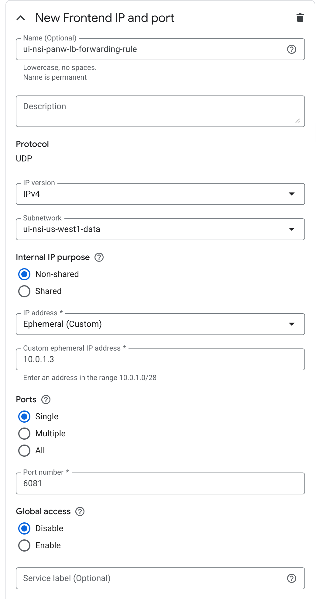

Allow a brief period for the configuration to take effect, after which the Frontend Health Check status should indicate "100% health."Creation of NSI Deployment Group

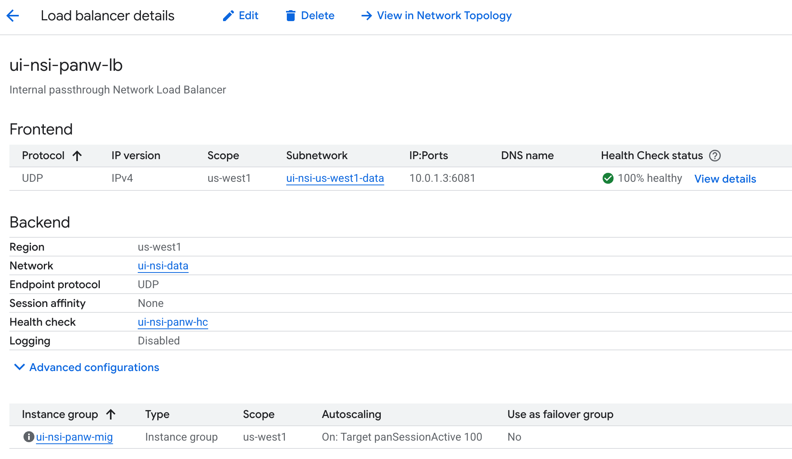

## Create NSI Deployment Group:

Navigate to Network Security \-\> Deployment groups, and select "Create deployment group." Configure the settings as follows:

* **Name:** `ui-nsi-demo-deployment-group` (Or a preferred, descriptive name)  
* **Network:** `ui-nis-data` (Pre-provisioned by the Terraform template; this is the location of the NGFW data network)  
* **Purpose:** NSI In-Band (Intercept mode; NSI Out-of-Band may be selected for traffic mirroring solely for monitoring purposes)  
  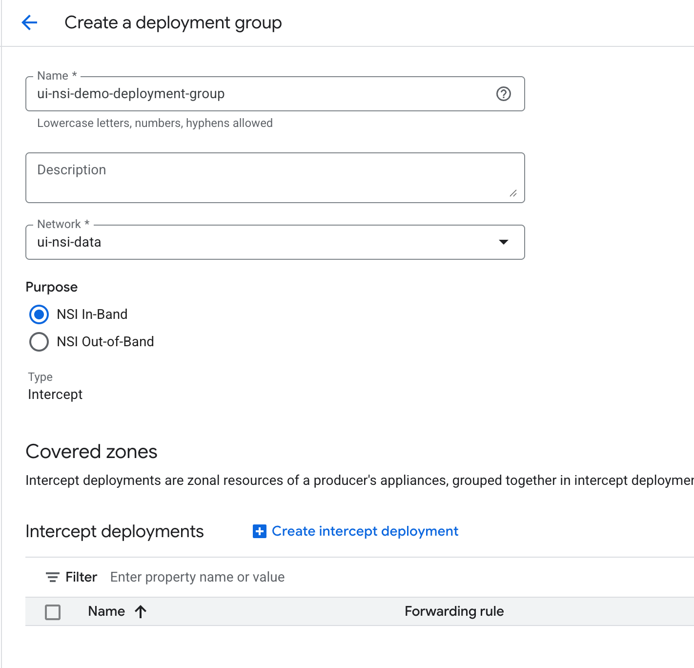

Select "Create Intercept deployment" and configure the settings:

* **Name:** `ui-nsi-demo-deployment`  
* **Region:** `us-west1`  
* **Zone:** `us-west1-a`  
* **Load balancer:** `ui-nsi-panw-lb`  
* **Forwarding rule:** `ui-nis-panw-lb-forwarding-rule` (The rule created in the preceding step)

**Note:** The preceding steps may be replicated to create multiple intercept deployments for individual zones, should the protection of resources across various zones be required. For the purpose of this demonstration, interception is enabled exclusively for resources within the `us-west1-a` zone.

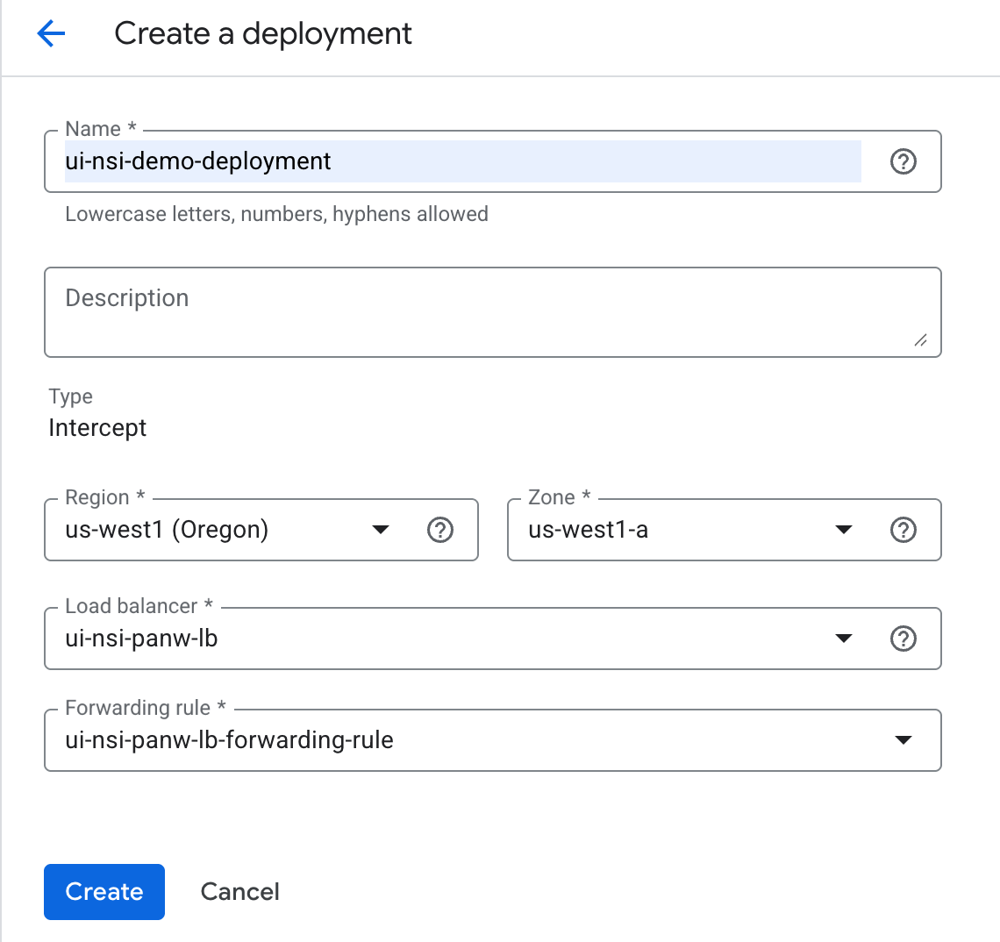

Select "Create" to proceed.

After a short waiting period, the intercept deployment's status should transition to "Active." This concludes the configuration within the Producer project. The process now continues with the Consumer project, where the protected resources reside.On the Consumer ProjectCreation of Intercept Endpoint & Endpoint Group

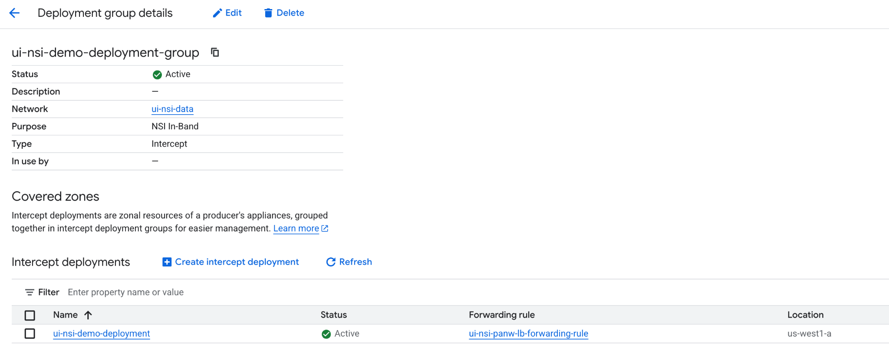

# On the Consumer project

## Create Intercept Endpoint & Endpoint Group

Navigate to Network Security \-\> Endpoint groups, and select "Create endpoint group." Configure the settings as follows:

* **Name:** `ui-nsi-demo-epg`  
* **Purpose:** NSI In-Band (For interception; NSI Out-of-Band is used for mirroring and must align with the prior settings in the Deployment Groups within the Producer project)

For the **Deployment group**, select **Manual Entry**, and input the following information:

* **Project ID:** `<Your Producer project ID>`  
* **Deployment group name:** `ui-nsi-demo-deployment-group` (The deployment group name created previously in the producer project)

Select "Continue." In the "Associations" section, select "Add endpoint group association." Configure the settings as follows:

* **Project:** `<the name of the consumer project>` (Ensure that the Compute Engine API and Network Security API are enabled)  
* **Network:** `ui-nsi-consumer-vpc` (The VPC containing the resources to be protected; this VPC was pre-created by the Terraform template)

Select "Done" upon completion.

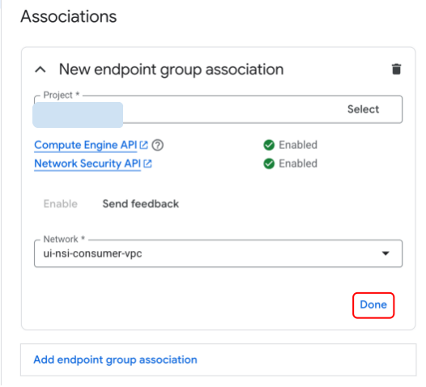

Select "Create" to provision the endpoint group.

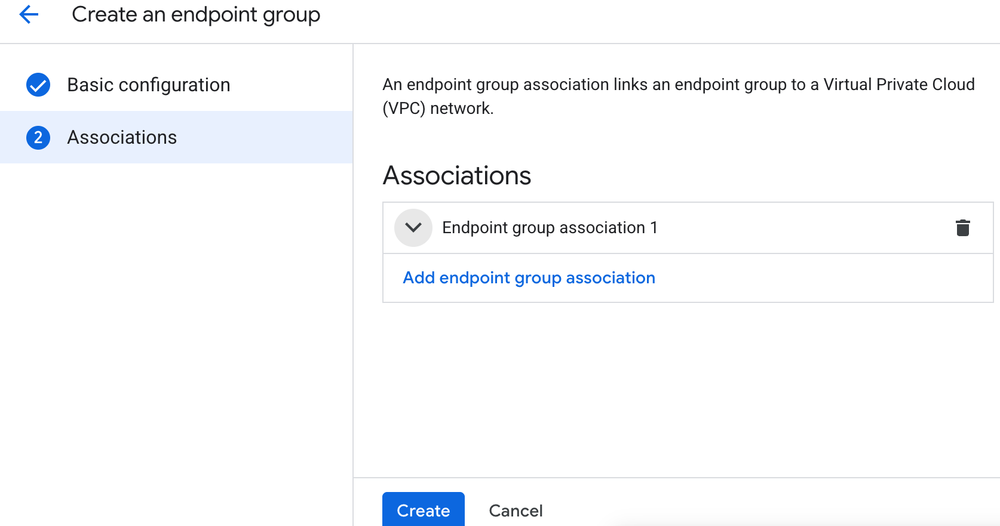

Allow a brief period for the configuration to take effect, and the endpoint group's status should indicate "Active."Creation of Security Profile and Security Profile Group

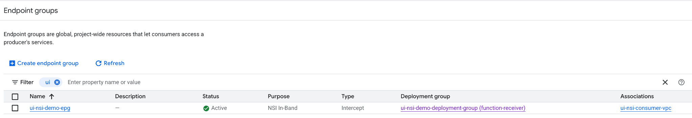

## Create the Security Profile and Security Profile Group

**Note:** Completion of the following steps requires the Org-level permissions outlined at the beginning of the documentation.

Navigate to Networks Security \-\> Common components \-\> Security profiles, and select "Create Security profile." Configure the settings as follows:

* **Name:** `ui-nsi-demo-sp`  
* **Purpose:** NSI In-Band  
* **Traffic directed to:**  
  * **Project:** `<Consumer project ID>`  
  * **Endpoint group:** `ui-nsi-demo-epg` (The endpoint group configured previously in the consumer project)

Select "Create."

Select the "Security profile groups" tab, and select "Create profile group."

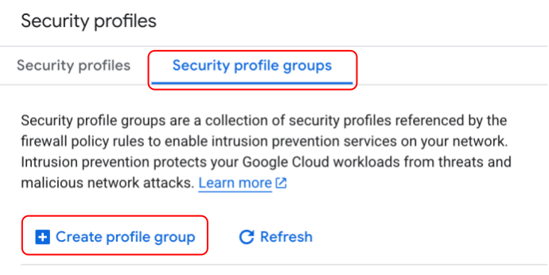

Configure the settings as follows:

* **Name:** `ui-nsi-demo-spg`  
* **Purpose:** NIS In-Band  
* **Custom Intercept profile:** `ui-nsi-demo-sp` (The security profile created in the preceding step)

Select "Create."  
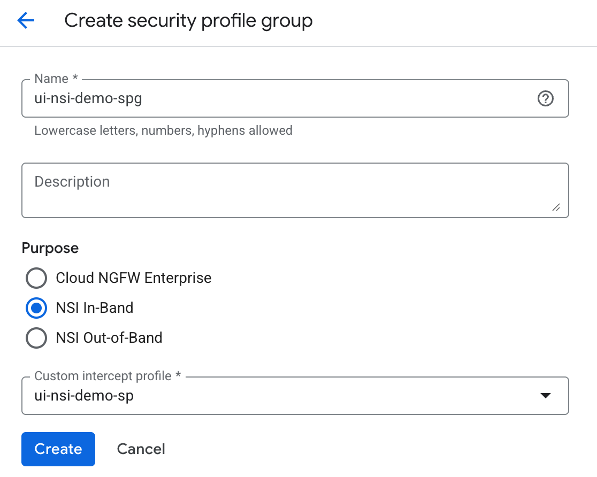

## Create Firewall Rules

Navigate to Cloud NGFW \-\> Firewall policies, and select "Create firewall policy." Configure the settings as follows:

* **Policy Name:** `ui-nsi-demo-consumer-policy`  
* **Policy Type:** VPC policy  
* **Deployment scope:** Global

Select "Continue."

Select "Create firewall rule." (Two firewall rules are required: one for egress to destination `0.0.0.0/0` and one for ingress from source `0.0.0.0/0`, with the action set to apply the security profile group created for NSI In-Band.)

* **Ingress rule:**  
  * **Priority:** 10  
  * **Direction of traffic:** Ingress  
  * **Action on match:** Apply security profile group.  
    * **Purpose:** NSI In-Band  
    * **Security profile group:** `ui-nsi-demo-spg`  
  * **Source filters:** IPv4: `0.0.0.0/0`  
  * All other settings should remain at their default values.  
* **Egress rule:**  
  * **Priority:** 11  
  * **Direction of traffic:** Egress  
  * **Action on match:** Apply security profile group.  
    * **Purpose:** NSI In-Band  
    * **Security profile group:** `ui-nsi-demo-spg`  
  * **Destination filters:** IPv4: `0.0.0.0/0`  
  * All other settings should remain at their default values.

Select "Continue" and bypass the "Add mirroring rules" section, as interception is being applied instead of mirroring.

In the **Associate policy with networks** section, select "Associate." Select the `ui-nsi-consumer-vpc` and select "Associate."  
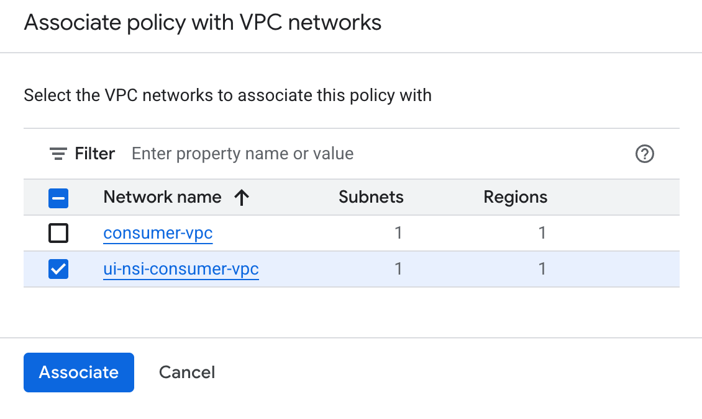  
Select "Create."

# (Optional) Deletion

## On the Consumer Project:

Navigate to Network Security \-\> Cloud NGFW \-\> Firewall policies.

Locate the Network firewall policy created by name.

### Remove the firewall policy associations.

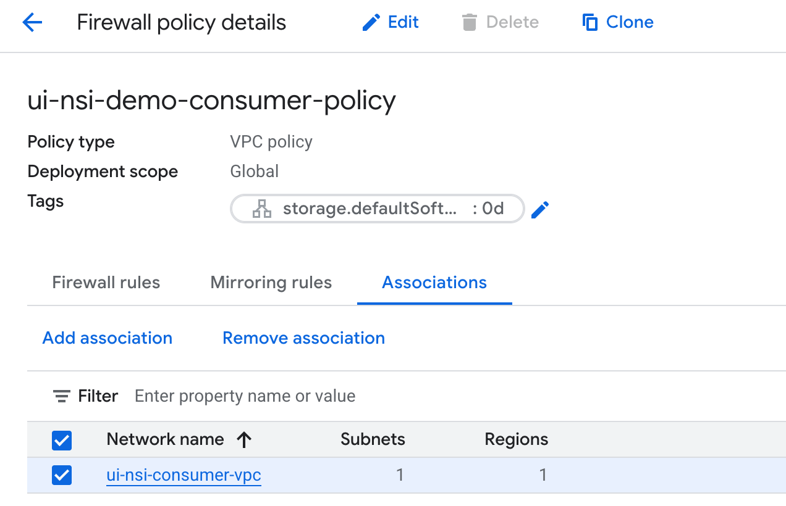

## Delete the Firewall policy.

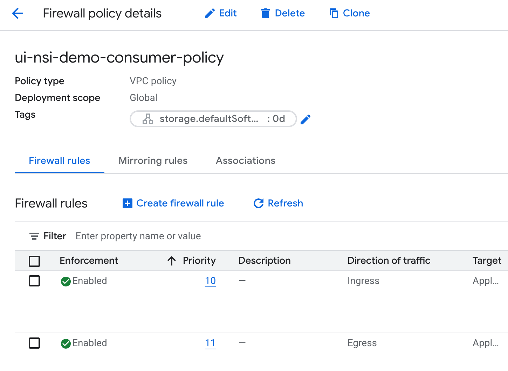

## Delete the Security Profile Group and Security Profile (Org-level permission is required).

Navigate to Network Security \-\> Common components \-\> Security profiles \-\> Security profile groups.

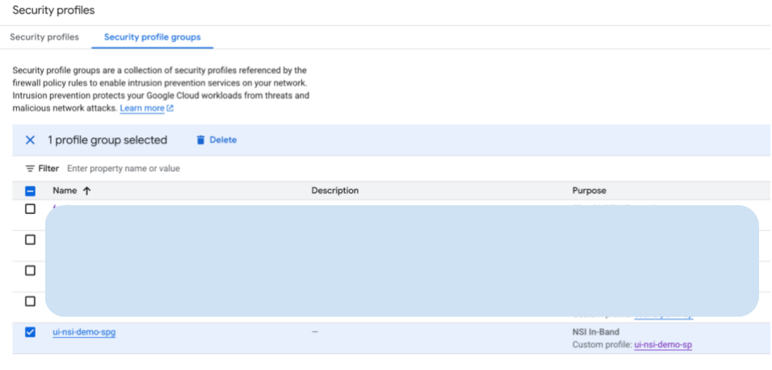

Select and delete the security profile group created.

Navigate to Network Security \-\> Common components \-\> Security profiles.

Select and delete the security profiles created.

Navigate to Network Security \-\> Cloud NSI \-\> Endpoint groups. Select the created endpoint group, select the association created, and delete it. (The association must be removed prior to deleting the endpoint group.) Subsequently, delete the endpoint group.

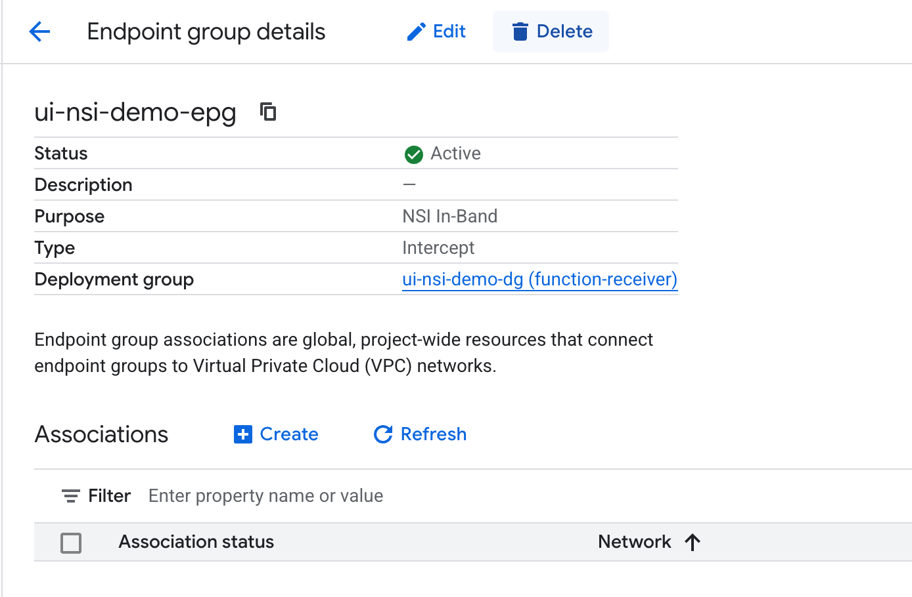

## On the Producer Project:

Navigate to Network Security \-\> Cloud NSI \-\> Deployment groups. Select the created deployment group. Select the intercept deployment endpoint, and delete it.

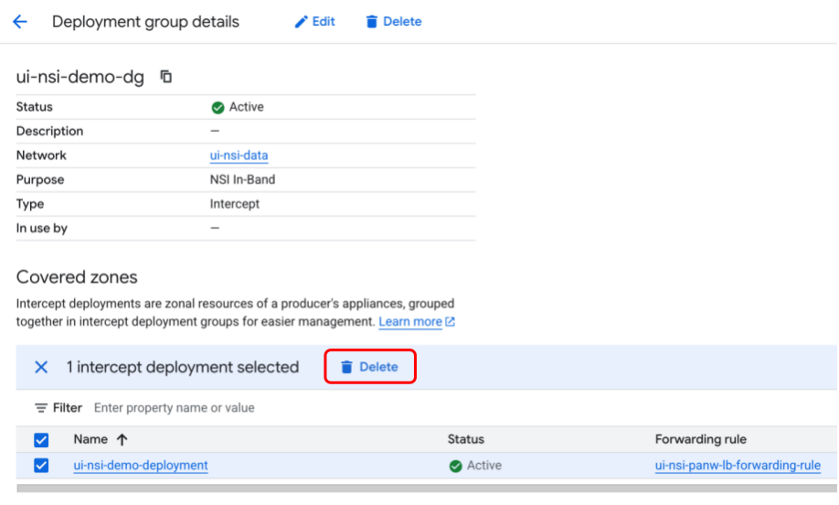

The deployment group may now be deleted.  

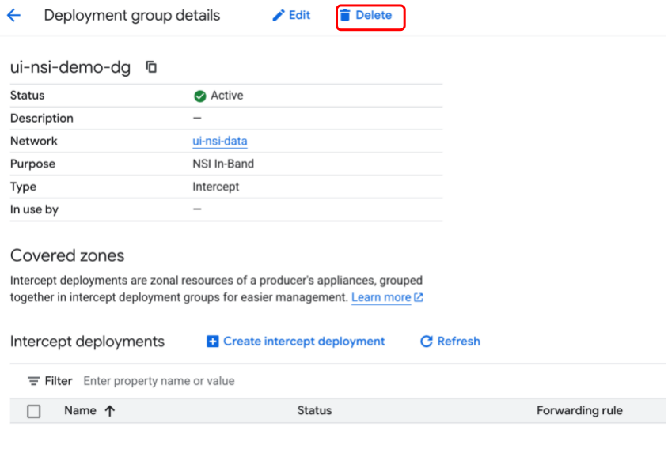