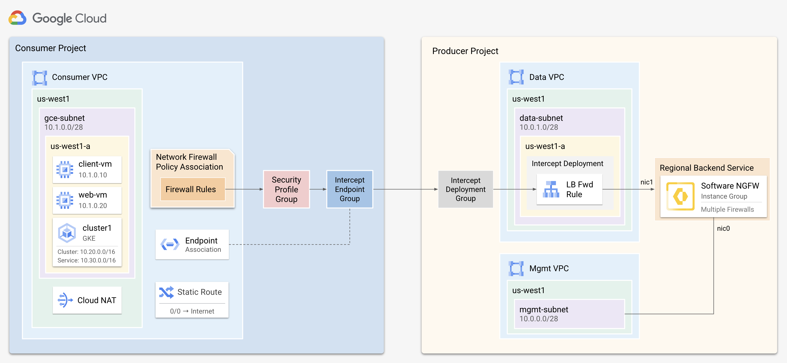
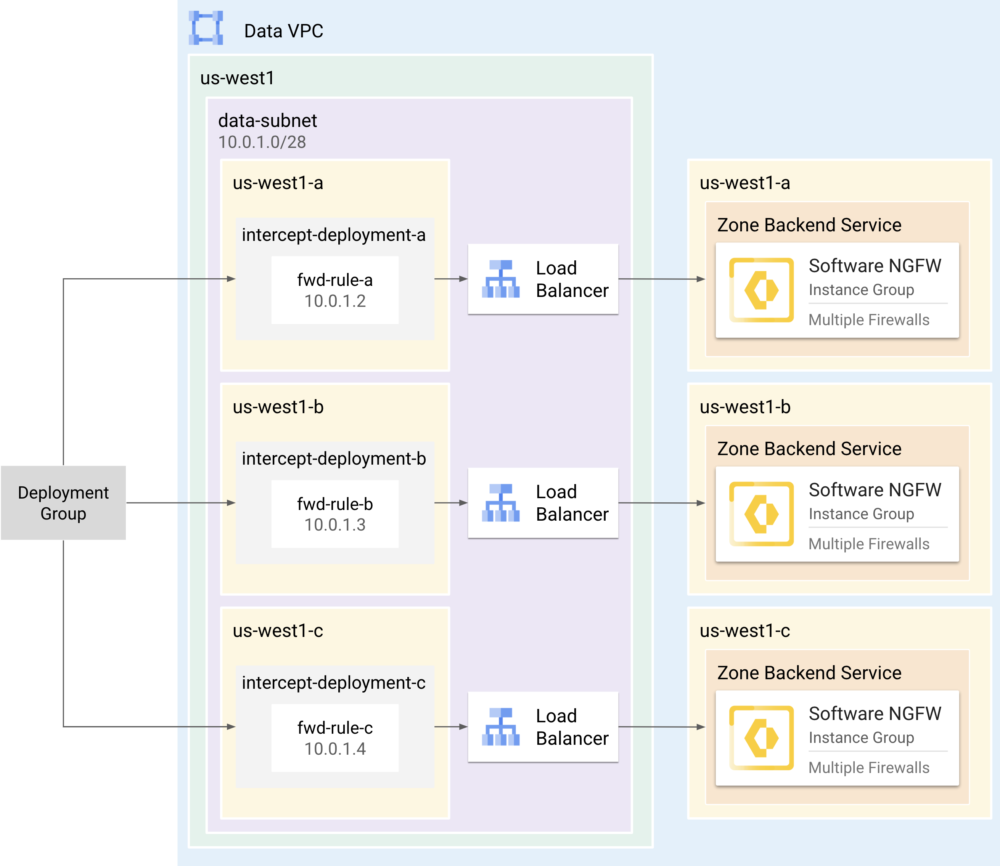
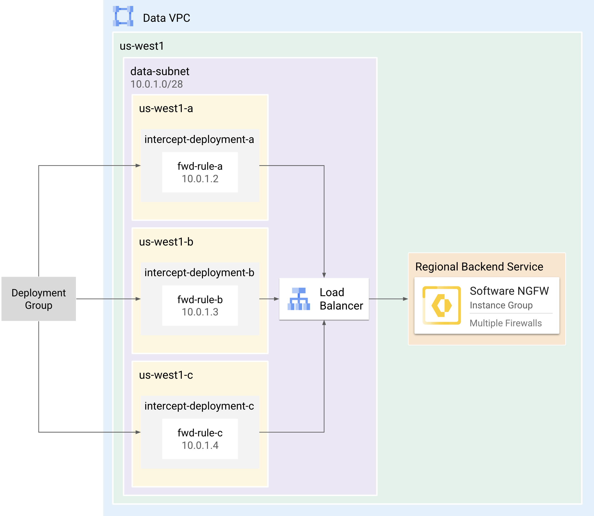
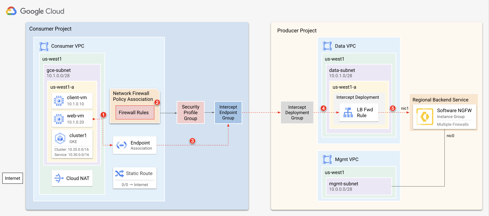
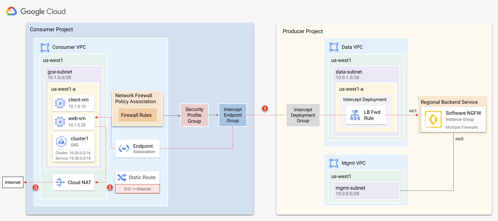
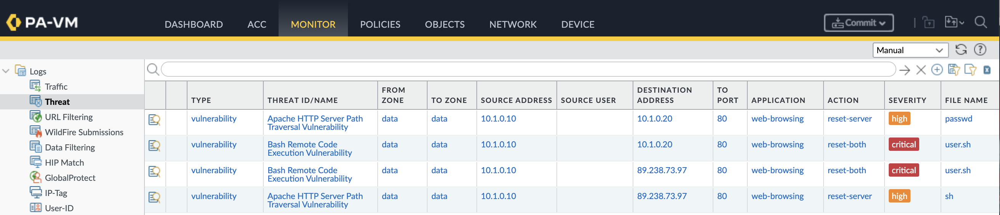

# UI-Based Deployment Guide for Software NGFW with Network Security Integration


This tutorial shows how to deploy Palo Alto Networks Software Firewalls in Google Cloud, utilizing either the *in-line* or *out-of-band* deployment model within the [Network Security Integration](https://cloud.google.com/network-security-integration/docs/nsi-overview) (NSI).  NSI enables you to gain  visibility and security for your VPC network traffic, without requiring any changes to your network infrastructure.  

The functionality of each model is summarized as follows:

| Model           | Description             |
| --------------- | ----------------------- |
| **Out-of-Band** | Uses packet mirroring to forward a copy of network traffic to Software Firewalls for *out-of-band* inspection. Traffic is mirrored to your software firewalls by creating mirroring rules within your network firewall policy. |
| **In-line**     | Uses packet intercept to steer network traffic to Software Firewalls for *in-line* inspection. Traffic is steered to your software firewalls by creating firewall rules within your network firewall policy. |

This tutorial is intended for network administrators, solution architects, and security professionals who are familiar with [Compute Engine](https://cloud.google.com/compute) and [Virtual Private Cloud (VPC) networking](https://cloud.google.com/vpc).


<br>

## Architecture

NSI follows a *producer-consumer* model, where the *consumer* consumes services provided by the *producer*. The *producer* contains the cloud infrastructure responsible for inspecting network traffic, while the *consumer* environment contains the cloud resources that require inspection.



### Producer Components

The producer creates firewalls which serve as the backend service for an internal load balancer. For each zone requiring traffic inspection, the producer creates a forwarding rule, and links it to an *intercept* or *mirroring* *deployment* which is a zone-based resource. These are consolidated into an *deployment group*, which is then made accessible to the consumer.

| Component | Description |
| :---- | :---- |
| [Load Balancer](https://cloud.google.com/network-security-integration/docs/out-of-band/configure-producer-service#create-int-lb-pm) | An internal network load balancer that distributes traffic to the NGFWs. |
| [Deployments](https://cloud.google.com/network-security-integration/docs/out-of-band/deployments-overview) | A zonal resource that acts as a backend of the load balancer, providing network inspection on traffic from the consumer. |
| [Deployment Group](https://cloud.google.com/network-security-integration/docs/out-of-band/deployment-groups-overview) | A collection of intercept or mirroring deployments that are set up across multiple zones within the same project.  It represents the firewalls as a service that consumers reference. |
| [Instance Group](https://cloud.google.com/compute/docs/instance-groups) | A managed or unmanaged instance group that contains the firewalls which enable horizontal scaling. |


#### Zone Affinity Considerations

The internal load balancer lacks zone-based affinity support. Therefore, consider the following architectures for your firewall deployment:

* **Zone-Based**: Ensures traffic is inspected by a firewall in the same zone as the consumer's source zone.
* **Cross-Zone**: Allows traffic to be inspected by any firewall within the same region as the traffic's source.

<table>
  <tr>
    <!-- Title cell with left alignment -->
    <th colspan="2" align="left">Zone-Based Deployment</th>
  </tr>
  <tr>
    <td width="35%"></td>
    <td width="65%">
      <ol>
        <li>Deploy the firewalls to a zone instance group corresponding to the source zone of the consumer.</li>
        <li>Add the instance group to a backend service.</li>
        <li>Create a forwarding rule targeting the backend service.</li>
        <li>Link the forwarding rule to an intercept/mirroring deployment that matches the zone you are inspecting.</li>
        <li>Add the deployment to a deployment group.</li>
        <li><b>Repeat steps 1-5</b> for each zone requiring inspection.</li>
      </ol>
    </td>
  </tr>
  <tr>
    <!-- Title cell with left alignment -->
    <th colspan="2" align="left">Cross-Zone Deployment</th>
  </tr>
  <tr>
    <td width="35%"></td>
    <td width="65%">
      <ol>
        <li>Deploy the firewalls to a regional instance group matching the source region of the consumer.</li>
        <li>Add the instance group to a backend service.</li>
        <li>Create a forwarding rule targeting the backend service.</li>
        <li>Link the forwarding rule to an intercept/mirroring deployment matching the zone you wish to inspect.</li>
        <li>Add the deployment to the deployment group.</li>
        <li><b>Repeat steps 3-5</b> for each zone requiring inspection.</li>
      </ol>
    </td>
  </tr>
</table>

<br>

### Consumer Components

The consumer creates an *intercept* or *mirroring* *endpoint group* corresponding to the producer's *deployment group*. Then, the consumer associates the endpoint group with VPC networks requiring inspection. 

Finally, the consumer creates a network firewall policy with rules that use a *security profile group* as their action.  Traffic matching these rules is intercepted or mirrored to the producer for inspection.

| Component | Description |
| :---- | :---- |
| [Endpoint Group](https://cloud.google.com/network-security-integration/docs/out-of-band/endpoint-groups-overview) | A project-level resource that directly corresponds to a producer's deployment group. This group can be associated with multiple VPC networks. |
| [Endpoint Group Association](https://cloud.google.com/network-security-integration/docs/out-of-band/configure-mirroring-endpoint-group-associations) | Associates the endpoint group to consumer VPCs. |
| [Firewall Rules](https://cloud.google.com/firewall/docs/network-firewall-policies) | Exists within Network Firewall Policies and select traffic to be intercepted or mirrored for inspection by the producer. |
| [Security Profiles](https://cloud.google.com/network-security-integration/docs/security-profiles-overview) | Can be type `intercept` or `mirroring` and are set as the action within firewall rules. |

<br>

### Traffic Flow Example

The network firewall policy associated with the `consumer-vpc` contains two rules, each specifying a security profile group as their action. When traffic matches either rule, the traffic is encapsulated to the producer for inspection. 

<table>
  <tr>
    <!-- Title cell with left alignment -->
    <th colspan="5" align="center">Network Firewall Policy</th>
  </tr>
    <tr>
        <th>PRIORITY</th>
        <th>DIRECTION</th>
        <th>SOURCE</th>
        <th>DESTINATION</th>
        <th>ACTION</th>
    </tr>
    <tr>
        <td><code>10</code></td>
        <td><code>Egress</code></td>
        <td><code>0.0.0.0/8</code></td>
        <td><code>0.0.0.0/0</code></td>
        <td><code>apply-security-profile</code></td>
    </tr>
    <tr>
        <td><code>11</code></td>
        <td><code>Ingress</code></td>
        <td><code>0.0.0.0/0</code></td>
        <td><code>0.0.0.0/8</code></td>
        <td><code>apply-security-profile</code></td>
    </tr>
</table>

> [!NOTE]
> In the *out-of-band* model, traffic would be mirrored to the firewalls instead of redirected.  


#### Traffic to Producer


1. The `web-vm` makes a request to the internet. The request is evaluated against the rules within the Network Firewall Policy associated with the `consumer-vpc`.
2. The request matches the `EGRESS` rule (priority: `10`) that specifies a security profile group as its action.
3. The request is then encapsulated through the `endpoint association` to the producer environment.
4. Within the producer environment, the `intercept deployment group` directs traffic to the `intercept deployment` located in the same zone as the `web-vm`.
5. The internal load balancer forwards the traffic to an available firewall for deep packet inspection.

#### Traffic from Producer


1. If the firewall permits the traffic, it is returned to the `web-vm` via the consumer's `endpoint association`.
2. The local route table of the `consumer-vpc` routes traffic to the internet via the Cloud NAT.
3. The session is established with the internet destination and is continuously monitored by the firewall. 

---

<br>

## Requirements

> [!WARNING] 
> The *in-line* model is currently in private preview and must be enabled for your Google Cloud account. 

1. A Google Cloud project.
2. Access to [Cloud Shell](https://shell.cloud.google.com). 
3. The following IAM Roles:

    | Ability | Scope | Roles |
    | :---- | :---- | :---- |
    | Create [firewall endpoints](https://cloud.google.com/firewall/docs/about-firewall-endpoints#iam-roles), [endpoint associations](https://cloud.google.com/firewall/docs/about-firewall-endpoints#endpoint-association), [security profiles](https://cloud.google.com/firewall/docs/about-security-profiles#iam-roles), and [network firewall policies](https://cloud.google.com/firewall/docs/network-firewall-policies#iam). | Organization | `compute.networkAdmin`<br>`compute.networkUser`<br>`compute.networkViewer` |
    | Create [global network firewall policies](https://cloud.google.com/firewall/docs/use-network-firewall-policies#expandable-1) and [firewall rules](https://cloud.google.com/firewall/docs/use-network-firewall-policies#expandable-8) for VPC networks. | Project | `compute.securityAdmin`<br>`compute.networkAdmin`<br>`compute.networkViewer`<br>`compute.viewer`<br>`compute.instanceAdmin` |


<br>

## Create Producer Environment
In the `producer` directory, use the terraform plan to create the producer's VPCs, instance template, instance group, internal load balancer, intercept deployment, and intercept deployment group. 

> [!TIP]
> In production environments, it is recommended to deploy the producer resources to a dedicated project.  This ensures the security services are managed independently of the consumer.

> [!CAUTION]
> It is required to make your cloudshell git support large file download, run below command to install git lfs before you start to clone the source code.
  
    sudo apt install git-lfs


1. In [Cloud Shell](https://shell.cloud.google.com), clone the repository change to the `producer` directory. 

    ```
    git clone https://github.com/PaloAltoNetworks/google-cloud-nsi-ui-demo.git
    cd google-cloud-nsi-ui-demo/producer
    ```

2. Create a `terraform.tfvars`.

    ```
    cp terraform.tfvars.example terraform.tfvars
    ```

3. Edit `terraform.tfvars` by setting values for the following variables:  
   
    | Key | Value | Default |
    | :---- | :---- | :---- |
    | `project_id` | The Google Cloud project ID of the producer environment. | `null` |
    | `mgmt_allow_ips` | A list of IPv4 addresses which have access to the firewall's mgmt interface. | `["0.0.0.0/0"]` |
    | `mgmt_public_ip` | If true, the management address will have a public IP assigned to it. | `true` | 
    | `region` | The region to deploy the consumer resources. | `us-west1` |
    | `image_name` | The firewall image to deploy. | `vmseries-flex-bundle2-1126`|
    | `mirroring_mode` | If true, configures the forwarding rule for packet mirroring. If false, configures it for in-band traffic. | `false` |


> [!CAUTION]
> It is recommended to set `mgmt_public_ip` to `false` in production environments.

> [!TIP]
> For `image_name`, a full list of public images can be found with this command:
> ```
> gcloud compute images list --project paloaltonetworksgcp-public --no-standard-images
> ```
> All NSI deployments require PAN-OS 11.2.x or greater.

> [!NOTE]
> If you are using BYOL image (i.e.  <code>vmseries-flex-<b>byol</b>-*</code>), the license can be applied during or after deployment.  To license during deployment, add your authcode to `bootstrap_files/authcodes`.  See [Bootstrap Methods](https://docs.paloaltonetworks.com/vm-series/11-1/vm-series-deployment/bootstrap-the-vm-series-firewall) for more information.  


4. Initialize and apply the terraform plan.

    ```
    terraform init
    terraform apply
    ```

    Enter `yes` to apply the plan.

5. After the apply completes, terraform displays the following message:

    <pre>
    export <b>PRODUCER_PROJECT</b>=<i>your-project-id</i>
    export <b>DATA_VPC</b>=<i>nsi-data</i>
    export <b>DATA_SUBNET</b>=<i>us-west1-data</i>
    export <b>REGION</b>=<i>us-west1</i>
    export <b>ZONE</b>=<i>us-west1-a</i>
    export <b>BACKEND_SERVICE</b>=<i>https://www.googleapis.com/compute/v1/projects/your-project-id/regions/us-west1/backendServices/panw-nsi-lb</i></pre>


> [!IMPORTANT] 
> The `init-cfg.txt` includes `plugin-op-commands=geneve-inspect:enable` bootstrap parameter, allowing firewalls to handle GENEVE encapsulated traffic forwarded via packet intercept. 
> If this is not configured, packet intercept traffic will be dropped. 

<br>

# ***On the Producer Project***


## Create NSI Deployment Group:

Navigate to Network Security \-\> Deployment groups, and select "Create deployment group." Configure the settings as follows:

* **Name:** `ui-nsi-demo-deployment-group` (Or a preferred, descriptive name)  
* **Network:** `ui-nis-data` (Pre-provisioned by the Terraform template; this is the location of the NGFW data network)  
* **Purpose:** NSI In-Band (Intercept mode; NSI Out-of-Band may be selected for traffic mirroring solely for monitoring purposes)  
  


Select "Create Intercept deployment" and configure the settings:

* **Name:** `ui-nsi-demo-deployment`  
* **Region:** `us-west1`  
* **Zone:** `us-west1-a`  
* **Load balancer:** `ui-nsi-panw-lb`  
* **Forwarding rule:** `ui-nis-panw-lb-forwarding-rule` (The rule created in the preceding step)

**Note:** The preceding steps may be replicated to create multiple intercept deployments for individual zones, should the protection of resources across various zones be required. For the purpose of this demonstration, interception is enabled exclusively for resources within the `us-west1-a` zone.


Select "Create" to proceed.

After a short waiting period, the intercept deployment's status should transition to "Active." This concludes the configuration within the Producer project. The process now continues with the Consumer project, where the protected resources reside.On the Consumer ProjectCreation of Intercept Endpoint & Endpoint Group


</br>

---

# ***On the Consumer project***

## Create Consumer Environment

In the `consumer` directory, use the terraform plan to create a consumer environment. The terraform plan creates a VPC (`consumer-vpc`) , two debian VMs (`client-vm` & `web-vm`), and a GKE cluster (`cluster1`) (optional).

> [!NOTE]
> If you already have an existing consumer environment, skip to [Create Intercept Endpoint Group](#create-intercept-endpoint--endpoint-group).

1. In Cloud Shell, change to the `consumer` directory.

    ```
    cd
    cd google-cloud-nsi-ui-demo/consumer
    ```

2. Create a `terraform.tfvars`

    ```
    cp terraform.tfvars.example terraform.tfvars
    ```

3. Edit `terraform.tfvars` by setting values for the following variables:  
   

    | Variable | Description | Default |
    | :---- | :---- | :---- |
    | `project_id` | The project ID of the consumer environment. | `null` |
    | `mgmt_allowed_ips` | A list of IPv4 addresses that can access the VMs on `TCP:80,22`. | `["0.0.0.0/0"]` |
    | `region` | The region to deploy the consumer resources. | `us-west1` |
    | `create_gke` | Whether to create the GKE cluster. | `false` |

4. Initialize and apply the terraform plan.

    ```
    terraform init
    terraform apply
    ```

    Enter `yes` to apply the plan.

5. After the apply completes, terraform displays the following message:

    <pre>
    export <b>CONSUMER_PROJECT</b>=<i>your-project-id</i>
    export <b>CONSUMER_VPC</b>=<i>consumer-vpc</i>
    export <b>REGION</b>=<i>us-west1</i>
    export <b>ZONE</b>=<i>s-west1-a</i>
    export <b>CLIENT_VM</b>=<i>client-vm</i>
    export <b>CLUSTER</b>=<i>cluster1</i>
    export <b>ORG_ID</b>=<i>$(gcloud projects describe your-project-id --format=json | jq -r '.parent.id')</i></pre>


<br>


## Create Intercept Endpoint & Endpoint Group

Navigate to Network Security \-\> Endpoint groups, and select "Create endpoint group." Configure the settings as follows:

* **Name:** `ui-nsi-demo-epg`  
* **Purpose:** NSI In-Band (For interception; NSI Out-of-Band is used for mirroring and must align with the prior settings in the Deployment Groups within the Producer project)

For the **Deployment group**, select **Manual Entry**, and input the following information:

* **Project ID:** `<Your Producer project ID>`  
* **Deployment group name:** `ui-nsi-demo-deployment-group` (The deployment group name created previously in the producer project)

Select "Continue." In the "Associations" section, select "Add endpoint group association." Configure the settings as follows:

* **Project:** `<the name of the consumer project>` (Ensure that the Compute Engine API and Network Security API are enabled)  
* **Network:** `ui-nsi-consumer-vpc` (The VPC containing the resources to be protected; this VPC was pre-created by the Terraform template)

Select "Done" upon completion.


Select "Create" to provision the endpoint group.


Allow a brief period for the configuration to take effect, and the endpoint group's status should indicate "Active."Creation of Security Profile and Security Profile Group


## Create the Security Profile and Security Profile Group

**Note:** Completion of the following steps requires the Org-level permissions outlined at the beginning of the documentation.

Navigate to Networks Security \-\> Common components \-\> Security profiles, and select "Create Security profile." Configure the settings as follows:

* **Name:** `ui-nsi-demo-sp`  
* **Purpose:** NSI In-Band  
* **Traffic directed to:**  
  * **Project:** `<Consumer project ID>`  
  * **Endpoint group:** `ui-nsi-demo-epg` (The endpoint group configured previously in the consumer project)

Select "Create."

Select the "Security profile groups" tab, and select "Create profile group."


Configure the settings as follows:

* **Name:** `ui-nsi-demo-spg`  
* **Purpose:** NIS In-Band  
* **Custom Intercept profile:** `ui-nsi-demo-sp` (The security profile created in the preceding step)

Select "Create."  


## Create Firewall Rules

Navigate to Cloud NGFW \-\> Firewall policies, and select "Create firewall policy." Configure the settings as follows:

* **Policy Name:** `ui-nsi-demo-consumer-policy`  
* **Policy Type:** VPC policy  
* **Deployment scope:** Global

Select "Continue."

Select "Create firewall rule." (Two firewall rules are required: one for egress to destination `0.0.0.0/0` and one for ingress from source `0.0.0.0/0`, with the action set to apply the security profile group created for NSI In-Band.)

* **Ingress rule:**  
  * **Priority:** 10  
  * **Direction of traffic:** Ingress  
  * **Action on match:** Apply security profile group.  
    * **Purpose:** NSI In-Band  
    * **Security profile group:** `ui-nsi-demo-spg`  
  * **Source filters:** IPv4: `0.0.0.0/0`  
  * All other settings should remain at their default values.  
* **Egress rule:**  
  * **Priority:** 11  
  * **Direction of traffic:** Egress  
  * **Action on match:** Apply security profile group.  
    * **Purpose:** NSI In-Band  
    * **Security profile group:** `ui-nsi-demo-spg`  
  * **Destination filters:** IPv4: `0.0.0.0/0`  
  * All other settings should remain at their default values.

Select "Continue" and bypass the "Add mirroring rules" section, as interception is being applied in this demo instead of mirroring (***use mirror rule instead of firewall rule if you are using mirroring mode.***).

In the **Associate policy with networks** section, select "Associate." Select the `ui-nsi-consumer-vpc` and select "Associate."  
        
      
Select "Create."

## Test Inspection

Test inspection by generating pseudo-malicious traffic between VMs and also between VMs and the internet.  Then, generate pseudo-malicious traffic within the GKE cluster (`cluster1`) to test pod-to-pod inspection.

### GCE Inspection
Simulate pseudo-malicious traffic for both east-west and north-south traffic flows.

1. In Cloud Shell, remotely generate pseudo-malicious traffic on the `client-vm` to simulate malicious traffic to the `web-vm` (east/west) and to the `internet` (north/south).

    ```
    gcloud compute ssh $CLIENT_VM \
        --zone $ZONE \
        --tunnel-through-iap \
        --command="bash -s" << 'EOF'
    curl -s -o /dev/null -w "%{http_code}\n" http://www.eicar.org/cgi-bin/.%2e/.%2e/.%2e/.%2e/bin/sh --data "echo Content-Type: text/plain; echo; uname -a" --max-time 2
    curl -s -o /dev/null -w "%{http_code}\n" http://www.eicar.org/cgi-bin/user.sh -H "FakeHeader:() { :; }; echo Content-Type: text/html; echo ; /bin/uname -a" --max-time 2
    curl -s -o /dev/null -w "%{http_code}\n" http://10.1.0.20/cgi-bin/user.sh -H "FakeHeader:() { :; }; echo Content-Type: text/html; echo ; /bin/uname -a" --max-time 2
    curl -s -o /dev/null -w "%{http_code}\n" http://10.1.0.20/cgi-bin/.%2e/.%2e/.%2e/.%2e/etc/passwd --max-time 2
    EOF
    ```

    (output)
    
    <pre>
    <b>000
    000 
    000
    000</b></pre>

    > The `000` response codes indicate that the traffic was blocked by the producer. 
    > The *out-of-band* deployment will not produce `000` response codes since it is only monitoring the traffic.


2. Retrieve the firewall’s management address.

    ```
    gcloud compute instances list \
        --filter='tags.items=(panw-tutorial)' \
        --format='table[box,title="Firewall MGMT"](networkInterfaces[0].accessConfigs[0].natIP:label=EXTERNAL_IP, networkInterfaces[0].networkIP:label=INTERNAL_IP)'
    ```

3. Access the firewall’s web interface using the management address.

    <pre>
    https://<b><i>MGMT_ADDRESS</i></b></pre>
    Username:
    ```
    admin
    ```
    Password:
    ```
    PaloAlto@123
    ```
---

4. On the firewall, go to **Monitor → Threat** to confirm the firewall prevented the north/south and east/west threats generated by the `client-vm` .

    

<br>


# (Optional) Deletion

## On the Consumer Project:

  1. Navigate to Network Security \-\> Cloud NGFW \-\> Firewall policies. Locate the Network firewall policy created by name.

  2. Remove the firewall policy associations.

     

  3. Delete the Firewall policy.

      

  4. Delete the Security Profile Group and Security Profile (Org-level permission is required).

      Navigate to Network Security \-\> Common components \-\> Security profiles \-\> Security profile groups.

      


      Select and delete the security profile group created.

      Navigate to Network Security \-\> Common components \-\> Security profiles.

      Select and delete the security profiles created.

      

      Navigate to Network Security \-\> Cloud NSI \-\> Endpoint groups. Select the created endpoint group, select the association created, and delete it. (The association must be removed prior to deleting the endpoint group.) Subsequently, delete the endpoint group.

      

  5. Run `terraform destroy` from the `consumer` directory.

        ```
        cd
        cd google-cloud-nsi-ui-demo/consumer
        terraform destroy
        ```

  6. Enter `yes` to delete all consumer resources.

## On the Producer Project:

  1. Navigate to Network Security \-\> Cloud NSI \-\> Deployment groups. Select the created deployment group. Select the intercept deployment endpoint, and delete it.

      

      The deployment group may now be deleted.  

      

  2. Run `terraform destroy` from the `/producer` directory.

        ```
        cd
        cd google-cloud-nsi-ui-demo/producer
        terraform destroy
        ```

  3. Enter `yes` to delete all producer resources.